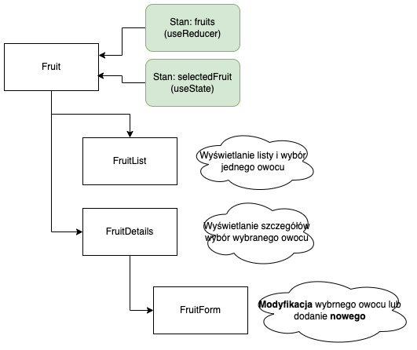

**Uwaga** W poniższych zadaniach należy dokonać stosownego podziału na komponenty wg pokazanego poniżej schematu. Nie używamy żadnych bibliotek do obsługi formularzy, korzystamy w tym zakresie tylko z pól input, przycisków oraz zdarzeń i funkcji ich obsługi. Obowiazuje korzystanie z hooków `useState` oraz `useReducer`

W zadaniu należy zwrócić szczególną uwagę na zagadnienia dyskutowane na wykładzie
- [Managing State](https://react.dev/learn/managing-state)

**Podział na komponenty** Poniższy diagram przedstawia wymagany układ komponentów. Szczególną uwagę należy poświęcić określaniu stanu komponentu (i komponentów zagnieżdżonych w przypadku "lifting state up") i przekazywaniu w dół hierarchii właściwości `props` 

**Uwaga** Korzystamy wyłącznie z komponentów funkcyjnych (tj. nie korzystamy z `class`)

**Zadanie 1.** 
Na podstawie przykładu z wykładu zrealizuj powyższy schemat ale z obiektami z własnej dziedziny (tj. tej określonej w pliku TematykaDziedzina w Teams - należy dla dziedziny wybrać 3-4 atrybutu *różnych* typów: liczbowy, boolean, napis itp.) i z bardziej rozbudowanym zbiorem atrybuów. W tym zadaniu nie korzystaj z rozwiązań `Context`.

**Zadanie 2.** 
W rozwiązaniu z zadania 1. wykorzystaj `Context` unikając `props drilling`

