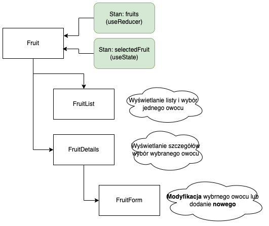

**Uwaga** W poniższych zadaniach należy dokonać stosownego podziału na komponenty wg pokazanego poniżej schematu. Nie używamy żadnych bibliotek do obsługi formularzy, korzystamy w tym zakresie tylko z pól input, przycisków oraz zdarzeń i funkcji ich obsługi. Obowiazuje korzystanie z hooków `useState` oraz `useReduce`. 

W zadaniu należy zwrócić szczególną uwagę na zagadnienia dyskutowane na wykładzie
- [Managing State](https://react.dev/learn/managing-state)

**Podział na komponenty** Poniższy diagram przedstawia wymagany układ komponentów. Szczególną uwagę należy poświęcić określaniu stanu komponentu (i komponentów zagnieżdżonych w przypadku "lifting state up") i przekazywaniu w dół hierarchii właściwości `props` 

**Uwaga** Korzystamy wyłącznie z komponentów funkcyjnych (tj. nie korzystamy z `class`)

**Zadanie 1.** 
Zmodyfikuj zadanie z poprzednich laboratoriów w następujący sposób:
- zdefiniuj własne hooks (funkcje ropozoczynające się od `use` i mające odpowiednią semantykę)
- zbuduj prosty formularz wraz z walidatorami przy wykorzystaniu narzędzia `formik`
